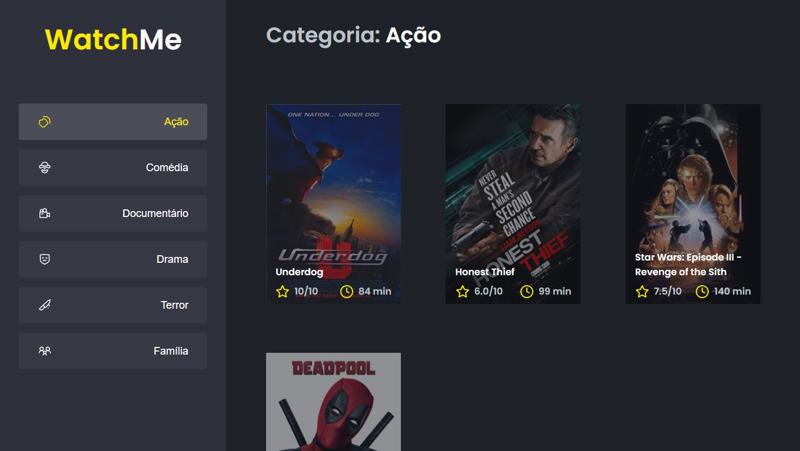

## 02 Desafio Ignite Reactjs

Uma aplicação para listagem de filmes de acordo com gênero, eles são obtidos através de uma Fake API. 
Desafio do curso Ignite da Rocketseat.

__Desafio proposto:__ realizar uma refatoração, dividindo o app em alguns componentes e resolvendo problemas de compartilhamento de estado [(elevando o state)](https://pt-br.reactjs.org/docs/lifting-state-up.html).

  

